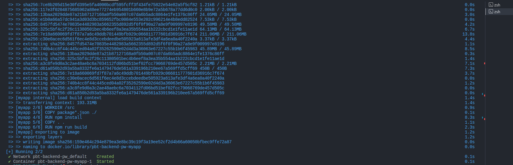

1.Instalar dependencias necesarias:

Dependicies: [@apollo/server, graphql]
devDependicies: [typescript, @types/node, ts-node, nodemon]

2.Git init = Agregar proyecto al repo de GitHub

3.Inicializar el servidor y hacer que el servidor de apollo/server, funcione tal y como se espera.

#COMANDOS CLAVES PARA INIZIALIZAR EL PROYECTO PARA NUESTRO ORM EN PRISMA (Nota: Toda la información suministrada en el siguiente documento es siguiento cada uno de los pasos de las librerias oficiales y busquedas por internet [`https://www.prisma.io/` , `ttps://graphql.org`, `Google.com`] )

4.Inicializamos el proyecto Prisma `npx prisma init`
Configuración Inicial:

Crea archivos de configuración necesarios para el proyecto, como prisma/schema.prisma.
Establece una estructura inicial para el esquema de la base de datos.
Instalación de Dependencias:

Descarga e instala las dependencias necesarias para trabajar con Prisma.
Creación de Archivos de Configuración:

Genera archivos necesarios para configurar la conexión a la base de datos, como prisma/.env para almacenar las variables de entorno.
Configuración de la Base de Datos:

Inicializa el archivo prisma/schema.prisma donde se define el modelo de datos y la conexión a la base de datos.
Preparación para Migraciones:

Configura el proyecto para trabajar con migraciones de base de datos usando Prisma.

5.Api rest GraphQL y Prisma, se realiza la conexión a la base de datos para obtener la info y realizar el introspect de la misma gracias al siguiente comando : `npx prisma introspect`
ESte comando se utiliza ara las introspecciones de las bases de datos y general un modelo de datos en GraphQL. En pocas palabras este comando permite a Prisma analizar la estructura actual de la base de datos y generar un esquema GraphQL correspondiente.

6.El comando npx prisma generate se utiliza para generar el código que Prisma necesita para interactuar con la base de datos según la definición del esquema en el archivo prisma/schema.prisma. Aquí hay un resumen de lo que hace este comando:

Generación de Código Prisma:

Examina el archivo prisma/schema.prisma para obtener información sobre la base de datos y el esquema.
Genera código Prisma en el directorio especificado en la configuración del proyecto (por lo general, node_modules/.prisma o una carpeta definida en la configuración).
Creación de Tipos y Funciones:

Crea tipos y funciones en el lenguaje de programación seleccionado (puede ser TypeScript o JavaScript) que permiten interactuar con la base de datos de manera segura y tipada.
Actualización Automática:

Este comando se ejecuta típicamente después de realizar cambios en el archivo prisma/schema.prisma o después de aplicar migraciones a la base de datos.
Asegura que el código Prisma esté siempre sincronizado con la estructura actual de la base de datos.
Integración con Entorno de Desarrollo:

Facilita el desarrollo al proporcionar funciones autocompletas y validación de tipos durante la escritura de consultas y operaciones de base de datos.

#GRAPHQL Resolvers.ts
MyContext desde el módulo context, y dos funciones (getUserRole y verifyTokenAndGetUserId) llamdos desde el módulo auth. Estos contienen funciones y utilidades relacionadas con la autenticación y el manejo de contextos.

Se define un objeto resolvers que contiene funciones para manejar las consultas (Query) y mutaciones (Mutation) de GraphQL. En este caso, solo se ha implementado la sección de consultas.
Esta función maneja la consulta GraphQL getUsers. Utiliza el objeto context para acceder a la instancia de Prisma (context.prisma) y recuperar una lista de usuarios desde la base de datos. Luego, selecciona solo ciertos campos (id, name, roleId) de cada usuario y los devuelve. Si hay algún error durante la consulta a la base de datos, se lanza una excepción.

getUserById esta funcion maneja la consulta GraphQL getUserById. Primero, verifica si hay un userId en el contexto, y si no lo hay, lanza una excepción indicando que el usuario no está autenticado. Luego, utiliza Prisma para buscar un usuario por su ID, selecciona algunos campos y lo devuelve. Si hay algún error durante la consulta a la base de datos, se lanza una excepción.

getTokenSession esta función maneja la consulta GraphQL getTokenSession. Utiliza Prisma para buscar sesiones asociadas a un usuario por su ID. Si encuentra un token de sesión, lo devuelve; de lo contrario, devuelve null. También maneja cualquier error durante la consulta a la base de datos lanzando una excepción.

Schemas.ts
Aqui se define la estructura y operaciones para un servicio GraphQL:

Tipos de datos:

User: Información de un usuario.
Session: Token de sesión para un usuario.
Interaction: Detalles de una interacción, como país y tiempo.
Country: Representación de un país.
Consultas (Query):

getUsers: Lista de usuarios.
getUserById: Información de un usuario por ID, con autenticación.
getTokenSession: Obtiene un token de sesión por ID de usuario.
getInteractions: Lista de todas las interacciones.
getCountries: Lista de países.
getInteractionsByUser: Interacciones de un usuario por su ID.
Mutaciones (Mutation): (En este caso no hacemos uso de ella)

En resumen, se establece cómo se ven y qué acciones se pueden realizar con usuarios, sesiones, interacciones y países en el servicio GraphQL.

Dockerfile
Construir la imagen:
Abre una terminal en el directorio que contiene tu Dockerfile y ejecuta el siguiente comando:

bash
Copy code
docker build -t nombre-de-tu-imagen .
Sustituye nombre-de-tu-imagen por el nombre que quieras darle a tu imagen. El punto al final indica que el Dockerfile se encuentra en el directorio actual.

Ejecutar el contenedor:
Después de que la imagen se haya construido correctamente, puedes ejecutar un contenedor basado en esa imagen:

bash
Copy code
docker run -p 4000:4000 nombre-de-tu-imagen
Esto mapea el puerto 4000 de tu máquina local al puerto 4000 dentro del contenedor.

Ahora, tu aplicación debería estar en funcionamiento y accesible en http://localhost:4000.

docker-compose.yml
version: '3.8': Indica la versión de Docker Compose que estás utilizando.

services: Define los servicios que componen tu aplicación.

myapp: Es el nombre del servicio, puedes cambiarlo según tus preferencias.

build: Indica cómo construir el contenedor. En este caso, especificamos el contexto (directorio actual) y el nombre del Dockerfile (Dockerfile).

ports: Mapea el puerto 4000 del host al puerto 4000 del contenedor. Puedes ajustar esto según tus necesidades.

